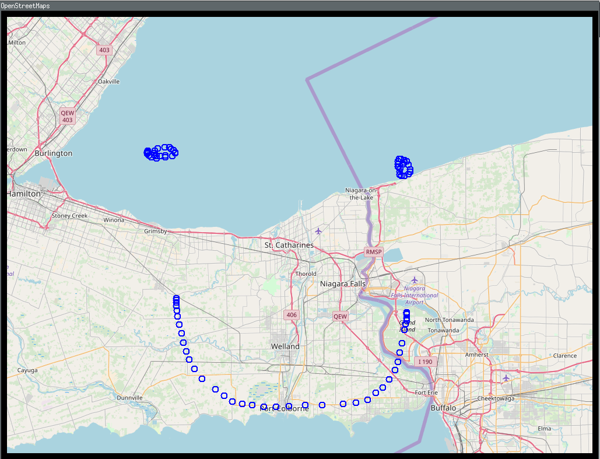

# Example

```
go get github.com/icholy/slippy/cmd/example
go get -d -v .
go run main.go
```

## Controls

* Arrow keys to navigate
* `+` / `-` keys to zoom
* Left click for placemark
	
## Screenshot


